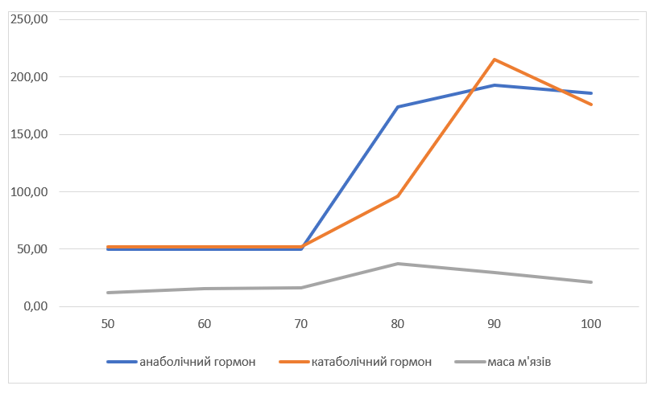

## Комп'ютерні системи імітаційного моделювання
## СПм-22-група, **ім'я**
### Лабораторна робота №**1**. Опис імітаційних моделей та проведення обчислювальних експериментів

 

### Варіант 12, модель у середовищі NetLogo:
[Muscle Development](http://www.netlogoweb.org/launch#http://www.netlogoweb.org/assets/modelslib/Sample%20Models/Biology/Muscle%20Development.nlogo)

 

### Вербальний опис моделі:
Модель розвитку м'язів під час тренувань.  Вона призначена для розуміння факторів, що впливають на створення відповідного гормонального балансу для розвитку м'язів від тренувань з важкими вантажами.
Коли спостерігач активує м'язове волокно за допомогою тренування з обтяженнями, волокно випромінює хімічний сигнал, що призводить до викиду гормонів у місці розташування волокна.

### Керуючі параметри:
- **lift** - вирішує, чи людина займається підняттям ваг.
- **intensity** - як важко працює людина. Чим більша інтенсивність, тим більша кількість м’язових волокон буде втомлюватися під час кожного тренування.
- **hours-of-sleep** - визначає час сну для відновлення м'язів. Від сна залежить відновлення органзіму, та відповідно наростання м’язів.
- **days-between-workouts** - визначає дні між тренуваннями. Частота тренувань впливає на те, скільки часу у тіла є для відновлення.
- **%slow-twitch-fibers** - визначає наскільки ймовірно, що кожне волокно матиме характеристики повільного скорочення.
  
### Внутрішні параметри:
- **fiber-size** - розмір м'язового волокна, відрізняється від вбудованого «розміру», оскільки використовує інші одиниці виміру
- **anabolic** - анаболічні гормони відновлюють м'язові волокна.
- **catabolic** - катаболічні гормони руйнують м'язові волокна.
- **hormone-diffuse-rate** - швидкість, з якою гормони поширюються з одного волокна в інші
- **muscle-mass** - зберігає суму розмірів м'язових волокон
  
### Показники роботи системи:
- Показники виділення анаболітичних та катаболічних гормонів. Вираховується як середній вміст гормону в кожному волокні
- Маса м'язових волокон. Зростання м'язів в залежності від гормонів, що виділяються.

### Недоліки моделі:
- модель має один вид вправ для м'язів, хоч і з різною інтенсивністю. Наприклад, силові тренування та аеробні вправи можуть мати різний вплив на м’язові волокна.
- не враховані параметри генетики людини. У деяких людей повільніший метаболізм, а у деяких швидший. Це може сильно впливати на розвиток м'язів, не говорячи про інші аспекти.
- не враховані випадкові відхилення від показників, які можуть виникати при тренеруваннях. В реальному житті буває таке, що людина менше поспить, або пропустить тренування. 
- не враховано якість та частоту харчування. Це важливий показник для розвитку м'язів.

### Примітки:
- Організм людини - це неймовірно складна система. Для того, щоб змоделювати ту частину, яка нас цікавить, були зроблені припущення щодо поведінки інших частин організму. Це можна побачити в жорсткому кодуванні різних параметрів, таких як ліміти гормонів і максимальні розміри м’язових волокон.
- Якщо гормонів у певній області занадто багато або мало, організм дуже старатиметься відновити баланс.
  
 

## Обчислювальні експерименти

### 1. Вплив інтенсивності тренування на ріст м'язів.
Досліджується залежність росту м'язів протягом певної кількості тактів (500) від інтенсивності тренування.
Експерименти проводяться при 50-100 інтенсивності, з кроком 10, усього 6 симуляцій.  
Інші керуючі параметри мають значення за замовчуванням:
- **hours-of-sleep**: 8
- **lift?**: on
- **days-between-workouts**: 5
- **%slow-twitch-fibers**: 50

<table>
<thead>
<tr><th>Інтенсивність</th><th>Анаболічний гормон</th><th>Катаболічний гормон</th><th>Маса м'язів</th></tr>
</thead>
<tbody>
<tr><td>50</td><td>50</td><td>52</td><td>12.3</td></tr>
<tr><td>60</td><td>50</td><td>52</td><td>15.4</td></tr>
<tr><td>70</td><td>50</td><td>52</td><td>16.6</td></tr>
<tr><td>80</td><td>174</td><td>96</td><td>37.7</td></tr>
<tr><td>90</td><td>193</td><td>215</td><td>29.4</td></tr>
<tr><td>100</td><td>186</td><td>176</td><td>21.2</td></tr>
</tbody>
</table>

Графік наочно показує, що  інтенсивність тренування впливає на розвиток м'язів. Загалом, з інтенсивністю тренування від 50 до 60, маса м'язів зменшується. Проте, при інтенсивності 70-100, маса м'язів збільшується, що може бути пов'язано зі збільшеною кількістю анаболітичних гормонів.

 

### 2. Вплив кількості годин сну на ріст м'язів.
Досліджується залежність росту м'язів протягом певної кількості тактів (500) від кількості годин сну.
Експерименти проводяться при 0-12 годин сну, з кроком 2, усього 7 симуляцій.  
Інші керуючі параметри мають значення за замовчуванням:
- **intensity**: 95
- **lift**: on
- **days-between-workouts**: 5
- **%slow-twitch-fibers**: 50

<table>
<thead>
<tr><th>Години сну</th><th>Анаболічний гормон</th><th>Катаболічний гормон</th><th>Маса м'язів</th></tr>
</thead>
<tbody>
<tr><td>0</td><td>200</td><td>250</td><td>2.8</td></tr>
<tr><td>2</td><td>197</td><td>227</td><td>7.2</td></tr>
<tr><td>4</td><td>184</td><td>182</td><td>8.1</td></tr>
<tr><td>6</td><td>194</td><td>211</td><td>14.7</td></tr>
<tr><td>8</td><td>186</td><td>180</td><td>23.6</td></tr>
<tr><td>10</td><td>191</td><td>155</td><td>39.2</td></tr>
<tr><td>12</td><td>94</td><td>53</td><td>28.8</td></tr>
</tbody>
</table>

Графік наочно показує, що при зі збільшенням тривалості сну спостерігається збільшення рівнів анаболічного гормону і зменшення рівнів катаболічного гормону, що значно впливає на розвиток м'язів. Можна зробити висновок, що оптимальна тривалість сну для максимального росту м'язів може бути приблизно 8-10 годин. 

 

### 3. Вплив періодичності тренування на ріст м'язів
Досліджується залежність росту м'язів протягом певної кількості тактів (500) від кількості днів між тренуваннями, зазначеного на початку симуляції.
Експерименти проводяться при 5-30 днів між тренуваннями, з кроком 5, усього 6 симуляцій.  
Інші керуючі параметри мають значення за замовчуванням:
- **hours-of-sleep**: 8
- **lift**: on
- **intensity**: 95
- **%slow-twitch-fibers**: 50

<table>
<thead>
<tr><th>Періодичність</th><th>Анаболічний гормон</th><th>Катаболічний гормон</th><th>Маса м'язів</th></tr>
</thead>
<tbody>
<tr><td>5</td><td>193</td><td>183</td><td>23.6</td></tr>
<tr><td>10</td><td>72</td><td>63</td><td>23.5</td></tr>
<tr><td>15</td><td>68</td><td>60</td><td>19.0</td></tr>
<tr><td>20</td><td>50</td><td>52</td><td>15.4</td></tr>
<tr><td>25</td><td>50</td><td>52</td><td>14.4</td></tr>
<tr><td>30</td><td>50</td><td>52</td><td>14.9</td></tr>
</tbody>
</table>

Графік наочно показує, що зі збільшенням періоду між тренуваннями спостерігається зменшення рівнів анаболічного гормону та збільшення рівнів катаболічного гормону. Це може пояснювати зменшення маси м'язів при тривалих перервах між тренуваннями, оскільки катаболічний гормон може сприяти розпаду м'язової тканини.
