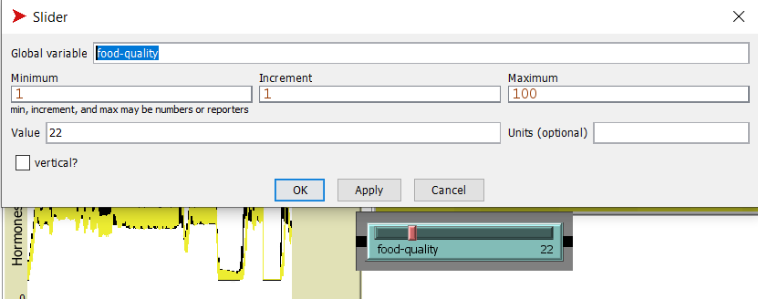
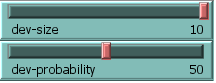
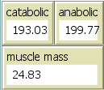
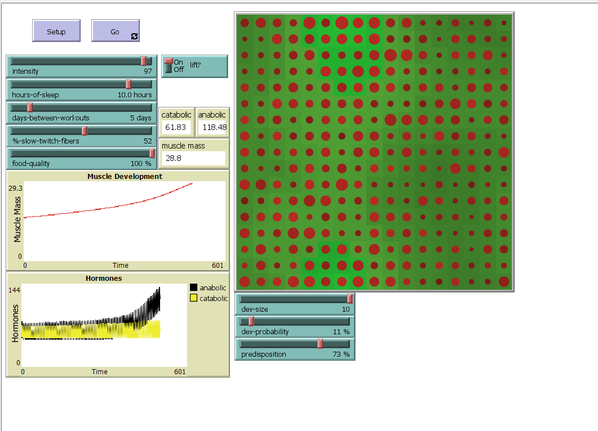
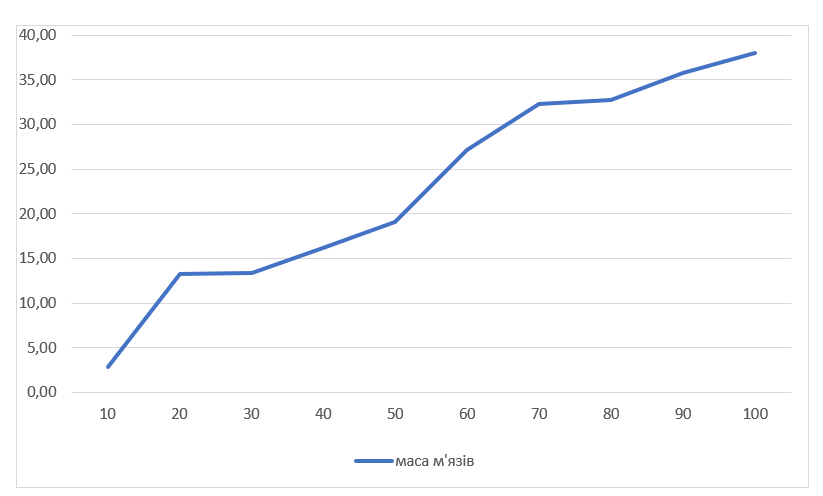

## Комп'ютерні системи імітаційного моделювання
## СПм-22-3, Левченко Антон
### Лабораторна робота №**2**. Редагування імітаційних моделей у середовищі NetLogo

 

### Варіант 12, модель у середовищі NetLogo:
[Muscle Development](http://www.netlogoweb.org/launch#http://www.netlogoweb.org/assets/modelslib/Sample%20Models/Biology/Muscle%20Development.nlogo)

 

### Внесені зміни у вихідну логіку моделі, за варіантом:

**Додати у моделі вплив харчування на можливість зростання м'язової маси.**
Змінено процедуру perform-daily-activity. До неї додано вплив їжі на виділення гормонів.
<pre>
to perform-daily-activity
  ;; simulate hormonal effect of lifestyle
  ;; activities like watching TV and working
  ask muscle-fibers [
    set catabolic-hormone catabolic-hormone + 2.0 * (log fiber-size 10)
    set anabolic-hormone anabolic-hormone + food-quality / 33 * (log fiber-size 10)
  ]
end
</pre>

Змінено процедуру lift-weights. Чим краща їжа, тим менше виділяється анаболічного гормнону. Адже при поганій якості їжі, організму може не вистачати деяких вітамінів, елементів та енергії під час тренерувань, тому він буде брати все це напряму з організму.
<pre>
to perform-daily-activity
  ;; simulate hormonal effect of lifestyle
  ;; activities like watching TV and working
  ask muscle-fibers [
    set catabolic-hormone catabolic-hormone + 2.0 * (log fiber-size 10)
    set anabolic-hormone anabolic-hormone + food-quality / 33 * (log fiber-size 10)
  ]
end
</pre>

Змінено процедуру grow. Якщо їжі буде не достатньо (або вона буде не правильна), то буде ні з чого будувати нові м'язи.
<pre>
to grow  ;; turtle procedure
  ;; catabolic hormones must prepare the fibers for growth before the
  ;; anabolic hormones may add mass to the fibers
  set fiber-size (fiber-size - 0.20 * (log catabolic-hormone 10))
  
  if(random-float 0.20 < food-quality / 100)[
  set fiber-size (fiber-size + 0.20 * min (list (log anabolic-hormone 10)
                                                (1.05 * log catabolic-hormone 10)))
  ]
end
</pre>

Був доданий слайдер з глобальною змінною "food-quality":

**Додати регулюємі користувачем параметри, що визначають вірогідність та міру відхилення від вказаних початкових значень інтенсивності тренувань, кількості годин сну та днів між тренуваннями.**

Додано два слайдера, які відповідають за вірогідність та міру відхилення:

Створено нову процедуру deviate, яке відповідає за відхилення початкових значень:
<pre>
to deviate
  if (random-float 1.0 < dev-probability / 100)[
    ifelse (random 2 mod 2 = 0)[set hours-of-sleep (hours-of-sleep - (hours-of-sleep / 100 * dev-size))]
                               [set hours-of-sleep (hours-of-sleep + (hours-of-sleep / 100 * dev-size))]
    ifelse (random 2 mod 2 = 0)[set days-between-workouts (days-between-workouts - (days-between-workouts / 100 * dev-size))]
                               [set days-between-workouts (days-between-workouts + (days-between-workouts / 100 * dev-size))]
    ifelse (random 2 mod 2 = 0)[set intensity (intensity - (intensity / 100 * dev-size))]
                               [set intensity (intensity + (intensity / 100 * dev-size))]
  ]
  
  set intensity round intensity
  set hours-of-sleep round hours-of-sleep
  set days-between-workouts round days-between-workouts
  
  if(intensity < 50) [ set intensity 50]
  if(intensity > 100) [ set intensity 100]
  if(hours-of-sleep < 0) [ set hours-of-sleep 0]
  if(hours-of-sleep > 12) [ set hours-of-sleep 12]
  if(days-between-workouts < 0) [ set days-between-workouts 0]
  if(days-between-workouts > 30) [ set days-between-workouts 30]
  
end
</pre>

### Внесені зміни у вихідну логіку моделі, на власний розсуд:

**Додано монітори для відбораження значень маси м'язів, анаболічних та катаболічних гормонів в данний момент**

**Додано вплив генетики людини на швидкість зростання м'яз.**

Створена нова процедура gen.
<pre>
to gen
  ;; simulate hormonal effect of human genetic
  ask patches [
    set catabolic-hormone catabolic-hormone - 0.25 * predisposition / 10
    set anabolic-hormone  anabolic-hormone - 0.35 * predisposition / 10
  ]
end
</pre>

Фінальний код моделі та її інтерфейс доступні за [посиланням](Muscle_Development2.nlogo).
 

## Обчислювальні експерименти
### 1. Вплив якості їжі на зростання м'язів

Досліджується залежність росту м'язів протягом певної кількості тактів (500) від якості їжі.
Експерименти проводяться при 10-100 процентів міри, з кроком 10, усього 10 симуляцій.  
Інші керуючі параметри мають значення за замовчуванням:
- **intensity**: 95
- **hours-of-sleep**: 8
- **lift**: on
- **days-between-workouts**: 5
- **%slow-twitch-fibers**: 50
- **predisposition**: 50;
- **dev-probability**: 2
- **dev-size**: 5

<table>
<thead>
<tr><th>Якість їжі</th><th>Маса м'язів</th></tr>
</thead>
<tbody>
<tr><td>10</td><td>2,89</td></tr>
<tr><td>20</td><td>13,27</td></tr>
<tr><td>30</td><td>13,32</td></tr>
<tr><td>40</td><td>16,18</td></tr>
<tr><td>50</td><td>19,06</td></tr>
<tr><td>60</td><td>27,18</td></tr>
<tr><td>70</td><td>32,23</td></tr>
<tr><td>80</td><td>32,71</td></tr>
<tr><td>90</td><td>35,74</td></tr>
<tr><td>100</td><td>37,96</td></tr>
</tbody>
</table>

Графік наочно показує, що чим краща якість харчування, тим кращий розвиток м'язів, при тих же початкових показниках.

 
