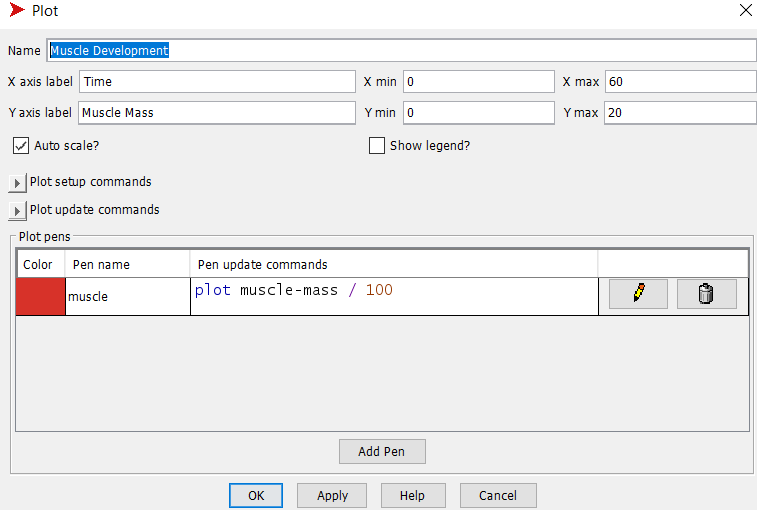

## Комп'ютерні системи імітаційного моделювання
## СПм-22-3, Антон Левченко
### Лабораторна робота №**3**. Використання засобів обчислювального интелекту для оптимізації імітаційних моделей

 

### Варіант 12, модель у середовищі NetLogo:

- **https://github.com/AntonLevchenko/KCIM/tree/main/1**

 

### Налаштування середовища BehaviorSearch:

**Обрана модель**:
<pre>
C:\Program Files\NetLogo 6.3.0\models\Sample Models\Biology\Muscle Development.nlogo
</pre>
**Параметри моделі**:  
<pre>
["days-between-workouts" [1 1 30]]
["hours-of-sleep" [0 0.5 12]]
["intensity" [50 1 100]]
["lift?" true false]
["%-slow-twitch-fibers" [0 1 100]]

</pre>
Використовувана **міра**:  
Для фітнес-функції  було обрано **значення маси м'язових волокон**, вираз для розрахунку взято з налаштувань графіка аналізованої імітаційної моделі в середовищі NetLogo  

  

та вказано у параметрі "**Measure**":

<pre>
muscle-mass / 100
</pre>

Маса м'язових волокон повинна враховуватися **в середньому** за весь період симуляції тривалістю, 500 тактів , починаючи з 0 такту симуляції.  
Параметр зупинки за умовою ("**Stop if**") не використовувався.  
Загальний вигляд вкладки налаштувань параметрів моделі:  

**Налаштування цільової функції**:  
Метою підбору параметрів імітаційної моделі, що описує ріст мускулів, є **максимізація** значення маси м'язових волокон – це вказано через параметр "**Goal**" зі значенням **Maximize Fitness**.
Тобто необхідно визначити такі параметри налаштувань моделі, у яких сума розмірів м'язових волокон є максимальною. При цьому цікавить не просто маса м'язових волокон у якийсь окремий момент симуляції,
а середнє значення за всю симуляцію, адже маса можу збільшуватись і зменшуватись, і потрібно знайти варіант, коли за весь час в середньому ця маса найбільша. Для цього у параметрі "**Collected measure**", що визначає спосіб обліку значень обраного показника, вказано **MAEN_ACROSS_STEPS**.  
Вважаю, що вплив випадковості не грає ролі, або взагалі відсутній в цій моделі, тому симуляція буде виконуватись всього 1 раз.
Загальний вигляд вкладки налаштувань цільової функції:  

**Налаштування алгоритму пошуку** (вкладка Search Algorithm):  
Загальний вид вкладки налаштувань алгоритму пошуку:  

 

### Результати використання BehaviorSearch:
Діалогове вікно запуску пошуку:  

Результат пошуку параметрів імітаційної моделі, використовуючи **генетичний алгоритм**:  

Результат пошуку параметрів імітаційної моделі, використовуючи **випадковий пошук**:  

